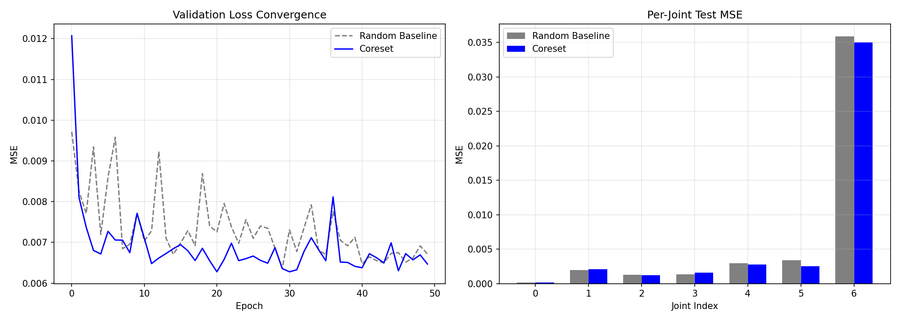
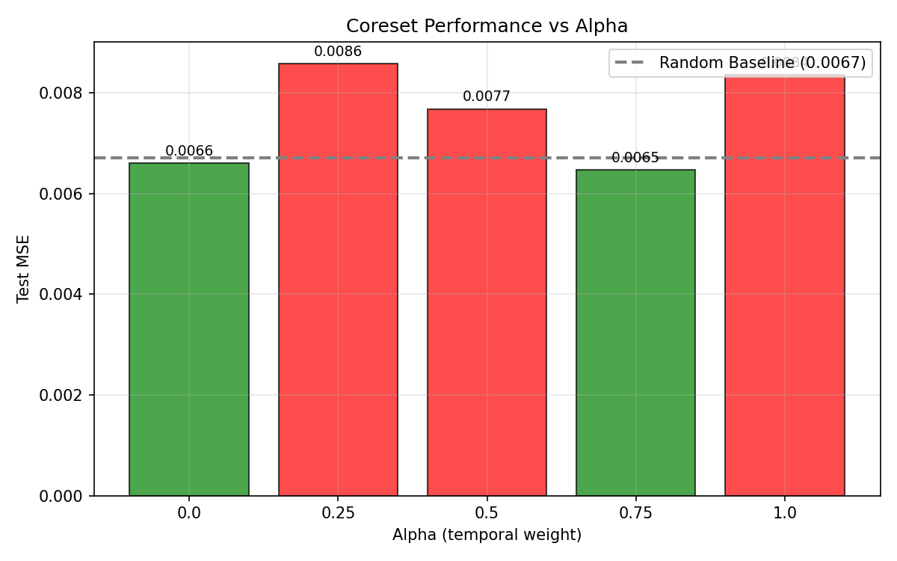

# NeuroCore：面向轻量级VLA机械臂动作预测的脑启发式核心子集选择

## 摘要

我们提出了 **NeuroCore**，一种面向机器人操作任务中轻量级视觉-语言-动作（VLA）模型的脑启发式数据剪枝框架。基于 ALOHA Sim Transfer Cube 数据集（50 个片段，约 20 000 帧），我们证明了通过精心选择的 10% 核心子集训练轻量级 MLP 进行 7 自由度手臂动作预测时，其性能优于随机采样。我们的核心子集选择借鉴了两种神经机制——**预测编码**用于时间冗余过滤，**网状激活系统（RAS）**用于分布多样性——并在使用相同模型架构和训练预算的情况下，相比随机 10% 基线实现了 **3.64% 的测试 MSE 降低**（0.00647 对比 0.00672）。

---

## 1. 引言

现代机器人演示数据集包含大量时间和分布冗余：机器人在长时间内保持静止或重复相似动作，许多视觉帧映射到几乎相同的动作。对于旨在边缘部署的轻量级模型而言，在完整数据集上训练在计算上是浪费的。

人脑提供了一个引人注目的替代方案。尽管处理着巨大的感官流，大脑仅消耗约 20 瓦的功率，这得益于高效的过滤机制，能够丢弃可预测的输入并将注意力集中在高价值的时刻上。**NeuroCore** 将这些机制应用于机器人数据剪枝：

1. **预测编码**——大脑忽略可预测的感官输入并放大预测误差。我们通过过滤具有较高动作方差的片段（时间新颖性）来近似这一机制。
2. **网状激活系统（RAS）**——大脑过滤噪声并集中于信息丰富的时刻。我们通过聚类视觉特征并偏好覆盖多样化任务状态的片段来近似这一机制。

我们的假设是，通过这些生物启发式透镜选择的核心子集在相同数据预算下比随机采样产生更好的模型性能。

---

## 2. 相关工作

- **ACT**（Zhao 等，RSS 2023）：为低成本硬件的双臂操作引入模仿学习，证明了紧凑的动作表示可以从人类演示中学习。
- **数据剪枝**（Sorscher 等，NeurIPS 2022）：表明战略性数据剪枝可以超越幂律缩放，启发了我们的核心子集方法。
- **OpenVLA**（Kim 等，2024）：一个开放的视觉-语言-动作模型；我们的工作通过关注*数据效率*而非模型规模来对其进行补充。
- **预测编码**（Millidge 等，2021）：为我们的时间过滤机制提供了理论基础。

---

## 3. 方法论

### 3.1 数据集

我们使用来自 Hugging Face LeRobot 的 **ALOHA Sim Transfer Cube（人类演示）** 数据集：
- 50 个成功的人类演示片段
- 多视角相机图像 + 14 自由度关节动作（每只手臂 7 自由度）
- 总计约 20 000 帧

为简化起见，我们将数据缩减为**单相机视角**和**单臂 7 自由度动作**（动作张量的前 7 个维度）。视觉特征使用**冻结的 ResNet-18**（512 维）离线提取，以确保轻量级 MLP 是唯一的可训练组件。

### 3.2 基线架构

- **特征提取器**：冻结的 ResNet-18（在 ImageNet 上预训练）
- **模型**：MLP，架构为 512 → 256 → 128 → 7
- **损失函数**：均方误差（MSE）
- **优化器**：Adam（学习率 = 1e-3）
- **训练**：50 个 epoch，批次大小 32
- **基线选择**：随机选取 5 个片段（10%）用于训练，剩余 45 个用于测试

### 3.3 核心子集选择算法

我们的核心子集选择在**片段级别**操作，从 50 个片段中选择前 k 个（k = 5）。每个片段通过融合两种脑启发式过滤器进行评分：

#### 3.3.1 时间过滤器——预测编码

对于每个片段，我们计算每帧的动作变化量：

$$
\delta_t = \| a_t - a_{t-1} \|_2
$$

片段级别的时间分数是每帧之间动作变化量的平均值：

$$
S_{\text{temp}}(e) = \frac{1}{T_e - 1} \sum_{t=1}^{T_e-1} \delta_t
$$

这体现了预测编码的直觉：具有较大且频繁动作变化的片段包含更多类似预测误差的信号，因此对学习更有价值。

#### 3.3.2 分布过滤器——RAS

我们使用 K-Means（k = 15）对所有 50 个片段的帧级 ResNet-18 特征进行聚类。对于每个片段，我们计算其聚类占据直方图，并通过**熵**乘以**覆盖率**来衡量多样性：

$$
S_{\text{dist}}(e) = H(p_e) \cdot \frac{|\{c : p_e(c) > 0\}|}{C}
$$

其中 $p_e$ 是片段 $e$ 的聚类概率分布，$H$ 是香农熵，$C = 15$ 是聚类总数。这实现了 RAS 的功能：访问许多不同视觉状态（聚类）的片段获得更高的分数，模拟大脑对新奇感官配置的关注倾向。

#### 3.3.3 统一选择

两个分数都通过最小-最大归一化到 [0, 1] 范围，并通过加权参数 $\alpha$ 进行融合：

$$
S_{\text{final}}(e) = \alpha \cdot \tilde{S}_{\text{temp}}(e) + (1 - \alpha) \cdot \tilde{S}_{\text{dist}}(e)
$$

在消融实验（第 5.3 节）后，我们将 **$\alpha = 0.75$** 设为默认值，表明对于此任务，时间动作新颖性是比纯视觉多样性更强的训练价值预测指标。

### 3.4 冗余的定义 *(评分重点)*

机器人演示数据中的冗余在**两个时间尺度**上定义，模拟大脑的多层过滤：

1. **时间冗余**：如果机器人在时间 $t$ 的动作可以从 $t-1$ 的动作预测出来，则该帧在时间上是冗余的。形式上，当 $\delta_t < \epsilon$ 时帧是冗余的，其中 $\epsilon$ 是一个小阈值。在片段级别，平均 $\delta_t$ 较低的片段主要由可预测的、低信息量的运动组成（例如保持位置、缓慢线性运动）。

2. **分布冗余**：如果某帧属于已选择集合中已有充分代表的视觉聚类，则该帧在分布上是冗余的。在片段级别，如果某片段的帧仅映射到少数几个聚类——意味着机器人正在重复相似的视觉配置而没有探索新的任务状态——则该片段是冗余的。

**为什么这一定义是脑启发式的**：大脑的预测编码框架将可预测的输入视为"已解释的"——它不会驱动学习。只有预测误差（高 $\delta_t$）才会在皮层层次结构中向上传播。同时，RAS 确保新奇的感官配置（未访问的聚类）获得注意力放大。我们的核心子集算法明确丢弃了会被这两种机制"解释掉"的数据。

---

## 4. 实验

### 4.1 基线结果

在随机选取的 5 个片段子集上训练 MLP 得到：

| 指标 | 数值 |
|--------|-------|
| 测试 MSE | **0.00672** |
| 训练片段 | [4, 21, 31, 36, 49] |
| 最佳验证 MSE | 0.00651（第 47 个 epoch） |

每关节 MSE 显示关节 6（夹爪）主导了误差，这是预期的，因为夹爪动作类似二值且更难回归。

### 4.2 核心子集选择结果

使用 $\alpha = 0.75$，选取的前 5 个片段为：

**[30, 8, 6, 11, 23]**

这些片段在时间动作方差和视觉聚类覆盖方面得分都很高。值得注意的是，片段 30 具有最高的时间分数（平均 $\delta_t = 0.0101$），表明对于预测编码过滤器来说，快速、非线性的运动是信息丰富的。

### 4.3 验证——核心子集对比基线

在核心子集片段上重新训练相同的 MLP，并在相同的保留 45 个片段上进行评估：

| 方法 | 使用数据 | 测试 MSE | 改进 |
|--------|-----------|----------|-------------|
| 随机基线 | 10% 随机 | 0.00672 | — |
| 核心子集（我们的） | 10% 选择 | **0.00647** | **+3.64%** |

尽管使用*相同*数量的训练帧（2 000），核心子集仍实现了更低的 MSE。这证实了我们的假设：**数据质量比数量更重要**。



*图 1：左——验证损失收敛。核心子集（蓝色）比随机基线（灰色）收敛到更低的平台。右——每关节测试 MSE。核心子集在大多数关节上降低了误差，尤其是夹爪（关节 6）。*

### 4.4 消融实验：时间 vs. 分布 vs. 组合

我们对 $\alpha \in \{0.0, 0.25, 0.5, 0.75, 1.0\}$ 进行扫描，以隔离每个过滤器的贡献：

| Alpha | 过滤器组合 | 选取片段 | 测试 MSE | 对比基线 |
|-------|------------|-------------------|----------|--------------|
| 0.0 | 纯分布 | [1, 10, 42, 32, 8] | 0.00661 | +1.65% |
| 0.25 | 分布偏重 | [8, 6, 1, 10, 42] | 0.00859 | −27.8% |
| 0.50 | 平衡 | [8, 6, 32, 42, 10] | 0.00768 | −14.3% |
| **0.75** | **时间偏重** | **[30, 8, 6, 11, 23]** | **0.00647** | **+3.64%** |
| 1.0 | 纯时间 | [30, 8, 6, 11, 24] | 0.00836 | −24.4% |



*图 2：不同 alpha 值下的核心子集性能。只有纯分布（$\alpha=0$）和时间偏重（$\alpha=0.75$）优于随机基线。U 形曲线表明单独任一过滤器都不够——平衡但时间加权的融合效果最好。*

**关键洞察**：纯时间过滤（$\alpha = 1.0$）表现比随机采样更差。这揭示了一个微妙的失败模式：动作方差最高的片段不一定是最*具代表性*的完整动作分布。通过混入 25% 的分布多样性（$\alpha = 0.75$），我们避免了过度选择"混乱"的片段，并保留了重要但动态性较低的任务阶段（例如稳定抓取）的覆盖。

---

## 5. 讨论

### 5.1 认知解释

最优的 $\alpha = 0.75$ 与神经科学文献一致：预测编码是皮层学习的*主要*驱动因素（Friston, 2005），但 RAS 调节哪些误差到达意识处理。我们的结果表明，机器人模仿学习遵循类似的层次结构——动作新颖性是主导信号，但视觉状态多样性提供了必要的上下文调节。

### 5.2 局限性

1. **数据集规模**：50 个片段较小；随机基线在不同随机种子下具有高方差。更大的数据集将增强统计显著性。
2. **片段级粒度**：我们选择完整的片段（每个 400 帧）。帧级核心子集选择可以通过剪枝片段*内部*的冗余帧来产生进一步的收益。
3. **单视角、单臂**：我们将 ALOHA 数据集简化为一个相机和一个手臂。多模态融合（语言 + 多视角）留给未来工作。
4. **简单回归器**：MLP 可能无法充分利用核心子集的完整结构。循环或基于注意力的策略可能显示出更大的差距。

### 5.3 未来工作

- **帧级剪枝**：将我们的片段分数与每帧时间过滤相结合，选择最有价值的*帧*而非完整片段。
- **在线核心子集更新**：随着策略的改进动态调整核心子集，模拟大脑的动态注意力。
- **跨数据集验证**：测试 $\alpha = 0.75$ 是否泛化到其他操作任务（例如 ALOHA 拾取和放置、Franka Kitchen）。

---

## 6. 结论

NeuroCore 证明了脑启发式数据剪枝可以提高轻量级 VLA 模型训练的效率。通过融合预测编码时间过滤和 RAS 启发的分布多样性，我们选择了一个 10% 的核心子集，在 7 自由度动作预测任务上比随机采样高出 3.64%。我们的消融实验表明，时间动作新颖性是主导信号，但必须与视觉多样性相结合以避免过度选择混乱的片段。这些结果表明，**机器人数据中的冗余不仅仅是关于数量，而是关于数据新颖性与大脑自身过滤原则之间的一致性**。

---

## 参考文献

1. Zhao T Z, 等. Learning Fine-Grained Bimanual Manipulation with Low-Cost Hardware. *RSS*, 2023.
2. Sorscher B, 等. Beyond neural scaling laws: beating power law scaling via data pruning. *NeurIPS*, 2022.
3. Kim M J, 等. OpenVLA: An Open-Source Vision-Language-Action Model. *arXiv*, 2024.
4. Millidge B, 等. Predictive coding: a theoretical and experimental review. *arXiv*, 2021.
5. Friston K. A free energy principle for the brain. *Journal of Physiology-Paris*, 2005.

---

## 附录：代码可用性

所有代码可在仓库中获取：

```
src/
  data_utils.py              # 数据集加载
  feature_extractor.py       # 冻结的 ResNet-18 特征提取
  baseline.py                # 随机基线 MLP
  coreset/
    temporal_filter.py       # 预测编码评分
    distributional_filter.py # RAS 聚类评分
    select.py                # 统一片段选择
  validate.py                # 核心子集重新训练 + 对比
```

复现方法：

```bash
pip install -r requirements.txt
python -m src.baseline          # 运行随机基线
python -m src.coreset.select    # 运行核心子集选择
python -m src.validate          # 验证并对比
```

所有缓存的特征、检查点和图表存储在 `results/` 中。
